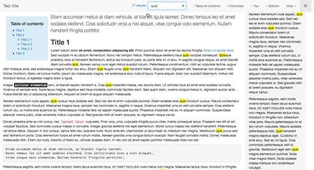

html5-quick-template
====================

A simple blank HTML5 template for quick rendering.

>   Have you ever wanted to quickly test a content with a more fun rendering than the default
    one of your browser? This single-file and easy-to-use template is just what you need!

## Key features

-   template built with [Bootstrap](http://getbootstrap.com/), [jQuery](http://jquery.com/)
    and [Font Awesome](http://fortawesome.github.io/Font-Awesome)
-   inclusion of libraries from a CDN (no local requirements)
-   default Bootstrap layout: fixed navbar on top and responsive page
-   printers friendly
-   search in page with highlight and count of results (3 chars. min)
-   use `TAB` key to select search field and `ESC` key to clear current search
-   query string to process a search on document load with `search=...`
-   simple profiler (hidden by default) visible on document load with query argument `profiler=on`

## Usage

Please note that the template requires a **PHP version 5.3.0** or greater.

### Basic usage

To use the template file, just define some simple variables and include the template:

    <?php

    // page title
    $title = 'Test title';

    // page content
    $content = <<<eot
    Etiam accumsan metus at diam vehicula, at blandit ligula laoreet.
    Donec tempus leo sit amet sodales eleifend. Cras sollicitudin eros a nisl aliquet,
    vitae congue odio elementum. Nullam hendrerit fringilla porttitor.
    eot;

    // include the template
    require '/path/to/html5-quick-template.html.php';

    ?>

Please see the source of the `test.php` file for a full example. The complete list of variables
to be (eventually) defined can be found in the `USER VARIABLES` part of the `html5-quick-template.html.php`
source file.

### Advanced usage

You can overload internal settings defining a `$settings` array in your script, with all
default settings entries or part of them. Please see the `SETTINGS` part in the `html5-quick-template.html.php`
source file for a full list.

The template is ready for internationalization and "left-to-right" languages (have a look
at the `LN STRINGS` part in the source file).

### Documentation

You can visualize both lists of definable variables and default settings when browsing the
`html5-quick-template.html.php` file directly.

## Author, license & contributions

This (*small*) work is authored and maintained by [@pierowbmstr](http://github.com/pierowbmstr)
and licensed under an [Apache 2.0 license](http://www.apache.org/licenses/LICENSE-2.0.html). To
propose modifications or tell about a bug, please create a ticket or a fork of the sources
repository at <http://github.com/pierowbmstr/html5-quick-template>.

This work is built with the help of the following third-parties:

-   [jQuery](http://jquery.com/) under [MIT license](http://github.com/jquery/jquery/blob/master/MIT-LICENSE.txt)
-   [Bootstrap](http://getbootstrap.com/) under [Apache license v2.0](http://www.apache.org/licenses/LICENSE-2.0)
-   [Font Awesome](http://fortawesome.github.io/Font-Awesome) under [SIL OFL 1.1 license](http://scripts.sil.org/OFL)
-   [HTML5shiv](http://code.google.com/p/html5shiv/) under [MIT license](http://www.opensource.org/licenses/mit-license.php)
-   [Respond.js](https://github.com/scottjehl/Respond) under [MIT license](http://www.opensource.org/licenses/mit-license.php)
